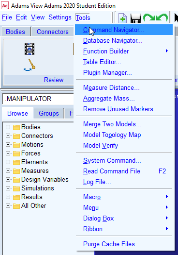

# Introduction
This repo provides a user interface for evaluating and visualising the eventual orientation of a [tendon-driven variable neutral line manipulator](https://ieeexplore.ieee.org/document/6661461?arnumber=6661461 "IEEE") given the input tension on each tendon through a proposed static force model.

This project is part of the research, initiated from Dec 2019, subsidised by the [University of New South Wales Taste of Research program](https://www.engineering.unsw.edu.au/taste-of-research-program).

# Prerequisite
- Conda (either Miniconda or Anaconda) (Tested version: 4.8.3)

# Get started
1. Make sure the environment has been created ([Tutorial](#installation))
2. Set up the environment ([Tutorial](#environment-setup))
2. Turn on the Adams View command server ([Tutorial](#steps-to-turn-on-adams-view-command-server))
2. Run the following:
    ```bash
    python example.py
    ```
1. Wait until the simulation has completed (or fail under certain circumstance). 
    - If the command window in Adams View shows the following line, that means the simulation fails to complete.
      
    
    - If the command window in Adams View does not display the line above, and the console outputs the following line, then the simulation is completed.
        ```bash
        Progress completed
        ``` 
    - Remark: Some steps may each take several hundreds iterations or more to converge (depending on your solver setting, but it is proportional to the number of joints and difference in applied tensions from observation). At these steps, the program seems freezed. Please do not terminate the process if it is unnecessary. 
    

# Installation
Run the following code in the terminal:
```bash
git clone https://github.com/dixon777/variableNeutralLineManipulator.git vnlm_math_model
cd vnlm_math_model
conda env create -f conda_env.yml
```

# Environment setup
Run the following code in the terminal:
```bash
conda activate vnlm_math_model
```

# Steps to turn on Adams View command server
1. Open Adam Views in your machine
1. Select the tab 'Tools' and pick the item 'Command Navigator...'  
      
2. Double click on item 'command_server'  
      
3. Double click on item 'show' below item 'command_server'  
      
4. Click on button 'Start server', and the window displays 'Server is accepting...'  
    
     - Note that if the disk CAD has not been generated before, it will be generated in STEP format,and imported into Admas View. The import takes about 75 seconds (may differ from machines) for each model. The program looks freezed during this stage. 
     After once generation, the CAD will be cached in parasolid format, which takes less than 1 second to be imported.

More details are in:
| Language 	| Link 	|
|---	|---	|
| English 	| Adams View Help 	|
| Chinese 	| [Link](https://www.itdaan.com/tw/43b5b4c3e1fa8de085124eda46cc3b80)


