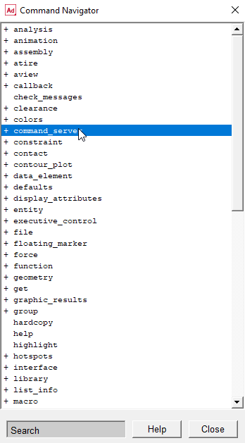
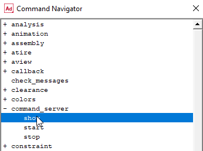
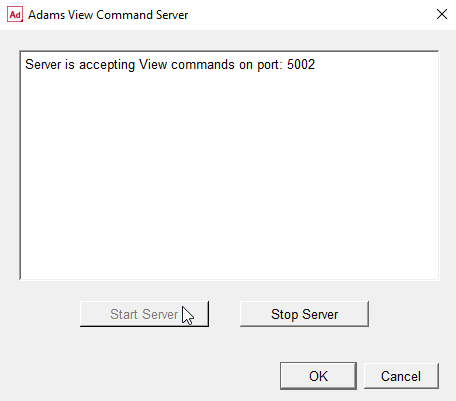

# Introduction
This repo provides a user interface for evaluating and visualising the eventual orientation of a [tendon-driven variable neutral line manipulator](https://ieeexplore.ieee.org/document/6661461?arnumber=6661461 "IEEE") given the input tension on each tendon through a proposed static force model.

This project is part of the research, initiated from Dec 2019, subsidised by the [University of New South Wales Taste of Research program](https://www.engineering.unsw.edu.au/taste-of-research-program).

# Prerequisite
- Conda (either Miniconda or Anaconda) (Tested version: 4.8.3)

# Get started
1. Make sure the environment has been created ([Tutorial](#installation))
2. Set up the environment ([Tutorial](#environment-setup))
2. Turn on the Adams View command server ([Tutorial](#steps-to-turn-on-adams-view-command-server))
2. Run the following:
    ```bash
    python run_cmd.py
    ```

# Installation
Run the following code in the terminal:
```bash
git clone https://github.com/dixon777/variableNeutralLineManipulator.git vnlm_math_model
cd vnlm_math_model
conda env create -f conda_env.yml
```

# Environment setup
Run the following code in the terminal:
```bash
conda activate vnlm_math_model
```

# Steps to turn on Adams View command server
1. Open Adam Views in your machine
1. Select the tab 'Tools' and pick the item 'Command Navigator...'
    
2. Double click on item 'command_server'
    
3. Double click on item 'show' below item 'command_server'
    
4. Click on button 'Start server', and the window displays 'Server is accepting...'
    

More details are in:
| Language 	| Link 	|
|---	|---	|
| English 	| Adams View Help 	|
| Chinese 	| [Link](https://www.itdaan.com/tw/43b5b4c3e1fa8de085124eda46cc3b80)


